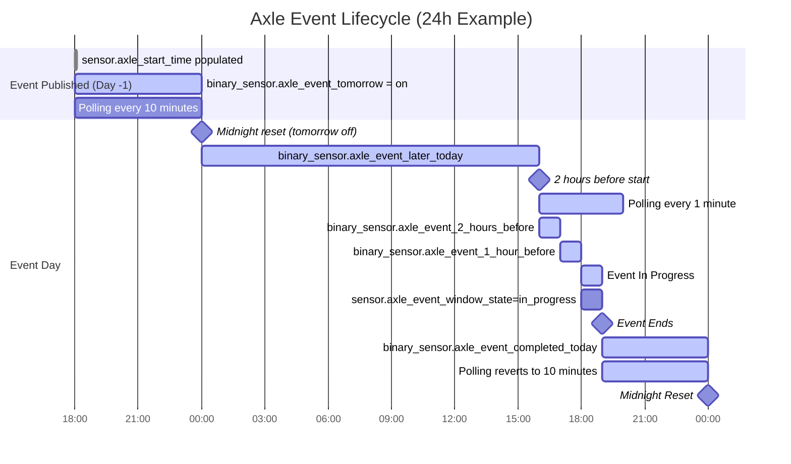

# Axle VPP – Home Assistant Integration

A custom Home Assistant integration for connecting to the Axle Energy Virtual Power Plant (VPP) API and exposing event data as sensors and binary sensors.

This integration:

- Authenticates using your Axle API token  
- Polls the Axle API for VPP event data  
- Dynamically adjusts polling frequency  
- Publishes timestamp, state, countdown and boolean sensors  
- Enables advanced automations around grid events  

---

## 🚀 Features

### Smart Polling

The integration uses a `DataUpdateCoordinator` with dynamic polling:

| Condition | Polling Interval |
|------------|------------------|
| No event / far from event | 10 minutes |
| Within 2 hours before event start | 1 minute |
| During event | 1 minute |
| After event ends | Reverts to 10 minutes |

This ensures:

- Low API load when idle  
- High responsiveness when an event is approaching or active  

---

## 📦 Entities Created

### Core API Sensors

| Entity | Description |
|--------|-------------|
| `sensor.axle_start_time` | Raw ISO event start time |
| `sensor.axle_end_time` | Raw ISO event end time |
| `sensor.axle_import_export` | Import/export indicator from Axle |
| `sensor.axle_updated_at` | Last update timestamp from Axle |

---

### Friendly Timestamp Sensors

| Entity | Description |
|--------|-------------|
| `sensor.axle_start_time_friendly` | Localised start time |
| `sensor.axle_end_time_friendly` | Localised end time |
| `sensor.axle_updated_at_friendly` | Localised update time |

---

### Calculated Sensors

| Entity | Description |
|--------|-------------|
| `sensor.axle_event_minutes_to_start` | Minutes until event begins |
| `sensor.axle_event_remaining_minutes` | Minutes remaining in event |
| `sensor.axle_event_window_state` | `upcoming`, `in_progress`, or `finished` |

---

### Time-Based Binary Sensors

| Entity | True When |
|--------|-----------|
| `binary_sensor.axle_event_in_progress` | Event is currently active |
| `binary_sensor.axle_event_1_hour_before` | 0–60 minutes before start |
| `binary_sensor.axle_event_2_hours_before` | 60–120 minutes before start |

---

### Date-Based Binary Sensors

| Entity | True When |
|--------|-----------|
| `binary_sensor.axle_event_tomorrow` | Event will occur tomorrow |
| `binary_sensor.axle_event_later_today` | Event is today but not yet started |
| `binary_sensor.axle_event_completed_today` | Event finished earlier today |

These date-based sensors automatically reset at midnight.

---

## 🧠 Architecture Overview

### API Client

- Uses `aiohttp`
- Authenticated via Bearer token
- Endpoint:  
  `https://api.axle.energy/vpp/home-assistant/event`
- Returns `None` when no event exists

### Coordinator

- Handles polling  
- Adjusts update interval dynamically (10 min / 1 min)  
- Triggers immediate refresh when switching modes  
- Exposes event data to all entities  

### Sensors

- Direct mapping sensors  
- Calculated sensors refresh every minute locally  
- Binary sensors subclass `BinarySensorEntity`  
- Countdown logic does not trigger additional API calls  

---

## 📅 Event Lifecycle (24-Hour Example)

The diagram below shows a typical cycle where an event is published 24 hours before it occurs.



---

# 🛠 Installation

## Step 1: Add Custom Repository in HACS

1. Open **HACS**
2. Go to **Integrations**
3. Click the three-dot menu → **Custom repositories**
4. Add this repository URL
5. Select category: **Integration**

---

### Step 2: Install the Integration

1. Go back to **HACS → Integrations**
2. Search for **Axle VPP**
3. Click **Install**

---

### Step 3: Configure the Integration

1. Go to **Settings → Devices & Services**
2. Click **Add Integration**
3. Search for **Axle VPP**
4. Enter your **Axle API token**
5. Save

Your sensors will appear under a device called **Axle VPP**.

---

# 🔑 Getting Your Axle API Token

Once your Axle account is active:

1. Log in to your Axle dashboard:  
   https://vpp.axle.energy
2. Navigate to **Account → Integrations / API**
3. Copy your API token
4. Paste it into the Axle VPP integration setup in Home Assistant

---

# 📝 How to Sign Up with Axle

Axle is a UK-based flexibility service that rewards households for supporting the electricity grid during periods of high demand.

### Sign-up process

1. Visit the Axle sign-up page:  
   https://vpp.axle.energy/landing?ref=R-JQDOUROD
2. Create an account
3. Upload a recent electricity bill (for meter and MPAN details)
4. Provide inverter access details
5. Add your electricity tariff information
6. Wait for approval and activation

Once approved, your API token will become available.

---

# 💷 Bonus Credit

If you register using the link above:

- **You receive £25 credit**
- **I also receive £25**

This helps support ongoing development and maintenance of this Home Assistant integration.

Using the referral link is optional, but very much appreciated.

---

# 📁 Directory Structure

```
custom_components/axle_vpp/
├── __init__.py
├── manifest.json
├── const.py
├── coordinator.py
├── sensor.py
├── config_flow.py
└── strings.json
```

---

# ⚙️ How It Works

- Uses Home Assistant’s `DataUpdateCoordinator`
- Polls Axle’s API dynamically:
  - Every **600 seconds** normally
  - Every **60 seconds** within 2 hours of an event and during the event
- Fetches event data from:  
  `https://api.axle.energy/vpp/home-assistant/event`
- Entities compute countdowns locally without additional API calls

---


## 💬 Support

If you encounter issues, please open a GitHub issue with logs and details.

Feature requests and contributions are welcome.

And if this integration helps you, using the Axle referral link genuinely supports future development.
